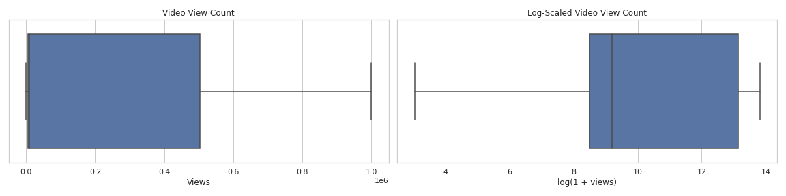

# 📊 TikTok Video Claim vs Opinion Analysis (EDA Project)

## 📌 Project Overview

This project performs a **comprehensive Exploratory Data Analysis (EDA)** on TikTok video data to identify patterns in video engagement, user behaviour, and moderation risk.

The primary objective was to explore how **claim-based videos** differ from **opinion-based videos** and identify signals that may help detect high-risk or misleading content.

---

## 📂 Dataset Summary

The dataset contains information about TikTok videos, including:

- Claim vs Opinion classification
- Video duration
- User verification status
- Author ban status
- Engagement metrics:
  - Views
  - Likes
  - Shares
  - Downloads
  - Comments

**Original dataset:** 19,382 rows  
**Cleaned dataset:** 19,084 rows  

---

## 🧹 Data Cleaning Steps

The following cleaning steps were performed:

- Removed unnecessary ID columns:
  - `#`
  - `video_id`
- Checked for missing values
- Removed rows containing missing data
- Checked for duplicate rows
- Verified correct data types
- Prepared cleaned dataset for analysis

---

## 🔍 Exploratory Data Analysis

The analysis focused on understanding distributions, engagement patterns, and category relationships.

### Techniques Used

- Distribution analysis
- Boxplots
- Histograms
- Scatterplots
- Median comparisons
- Category-based analysis
- Pie chart visualization
- Log transformation of skewed data

### Tools Used

- Python
- Pandas
- NumPy
- Matplotlib
- Seaborn
- Jupyter Notebook

---

## 📊 Key Insights

### 1️⃣ Claim Videos Receive Significantly More Views

Median video views:

- **Claim videos:** 501,555
- **Opinion videos:** 4,953

Claim-based videos spread significantly faster and receive substantially more engagement than opinion-based videos.

---

### 2️⃣ High-View Content Is Associated With Moderation Risk

Median views by author ban status:

| Ban Status | Median Views |
|------------|---------------|
| Active | 8,616 |
| Under Review | 365,245 |
| Banned | 448,201 |

This suggests that **high-engagement content may correlate with moderation risk**.

---

### 3️⃣ Verified Users Tend to Post More Opinions

Verified accounts are more likely to publish **opinions**, while unverified users contribute a larger share of **claims**.

---

### 4️⃣ Engagement Metrics Are Highly Skewed

Engagement variables such as:

- Views  
- Likes  
- Shares  
- Comments  

show strong **right-skewed distributions**, indicating viral-style behaviour where a small number of videos drive most engagement.

---

## 📈 Visualizations

Key visualizations created during this analysis include:

- Distribution of Video Views
- Log-Scaled View Count Boxplots
- Claim vs Opinion Engagement Comparison
- Scatterplot of Views vs Likes
- Total Views by Claim Status

Example visuals:

### Log-Scaled Video View Distribution

Video view counts are highly right-skewed, meaning a small number of videos receive extremely high views. Applying a log transformation improves visualization and highlights the distribution of most videos.

---

## 💡 Recommendations

Based on the analysis, the following recommendations were identified:

- Prioritize moderation of **high-view claim videos**
- Monitor **unverified accounts** more closely
- Use **log-transformed engagement metrics** for modelling
- Analyse **video transcription text** to identify misinformation patterns
- Focus moderation resources on viral content detection

---

## ⚙️ Technologies Used

| Tool | Purpose |
|------|--------|
| Python | Data analysis |
| Pandas | Data manipulation |
| NumPy | Numerical operations |
| Matplotlib | Visualization |
| Seaborn | Visualization |
| Jupyter Notebook | Development environment |

---

## 📁 Project Structure

